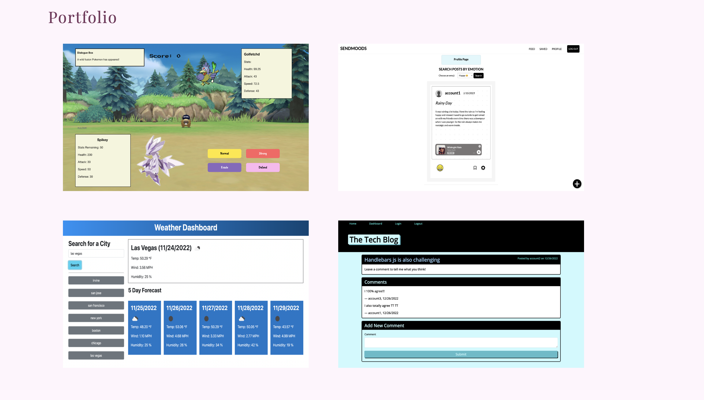
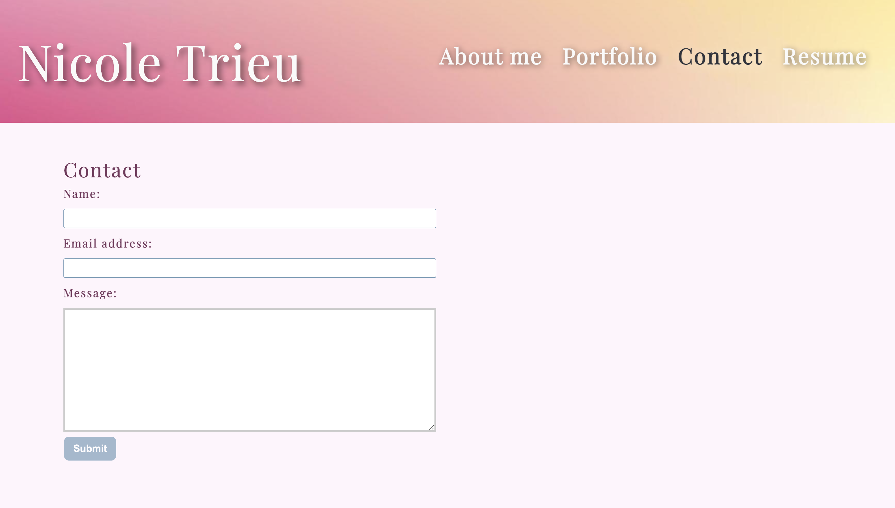
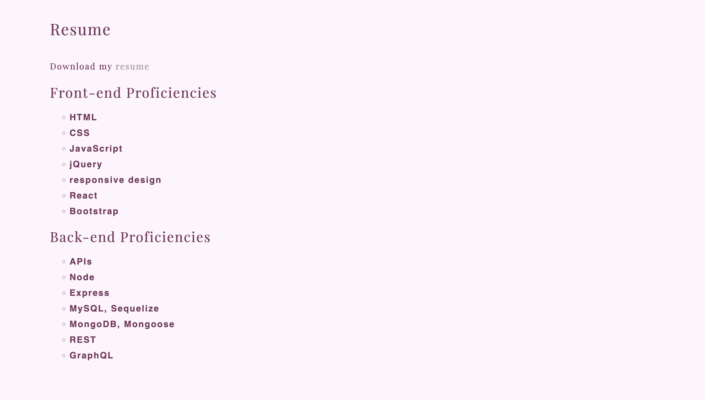

# Portfolio with React
## Description

This portfolio was built with React to showcase my skills as a developer.

## Table of Content

* [Installation](#installation)

* [Usage](#usage)

* [Contributing](#contributing)

* [Questions](#questions)   

## Installation

To install all necessary dependencies for development purposes, please run the command below:  

``npm i``  

``npm run start``

## Usage

To use this application, open the portfolio here: [https://nbtrieu.github.io/nt-portfolio/](https://nbtrieu.github.io/nt-portfolio/). Then click through the links on the Navbar at the top.

 
  

  

  

  

## Contributing

There are many ways in which you can participate in this project.
Users can contribute to this repo by submitting bugs and feature requests, reviewing source code changes, and making pull requests for any issues they can find.    

## Questions

For any questions or feedback, please feel free to email me at nbtrieu@uci.edu.
If you would like to check out more of my projects, please visit [nbtrieu](https://github.com/nbtrieu).
